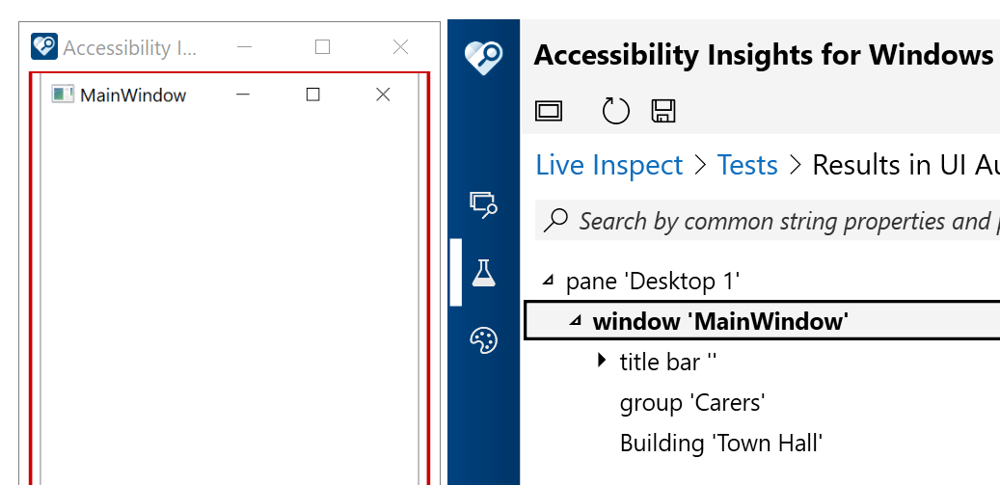

# WPFAccessibleUserControl

Despite this app's name, it does not show how to make WPF UserControls accessible. Rather, it simply shows a couple of ways to have the control type of a control as exposed through the UI Automation (UIA) API customized.

The screenshot below shows the Accessibility Insights for Windows tool reporting that two UserControls are being exposed through UIA as a Group named "Carers", and a Building called "Town Hall".

Note that if an app customizes the UIA ControlType, customers need it to support all those things required to be supported by that type of Control. For example, if it was delcared to be a TabItem, it must meet the requirements around UIA hierarchy, properties, patterns and events that are discussed at [TabItem Control Type](https://docs.microsoft.com/en-us/windows/win32/winauto/uiauto-supporttabitemcontroltype). 

